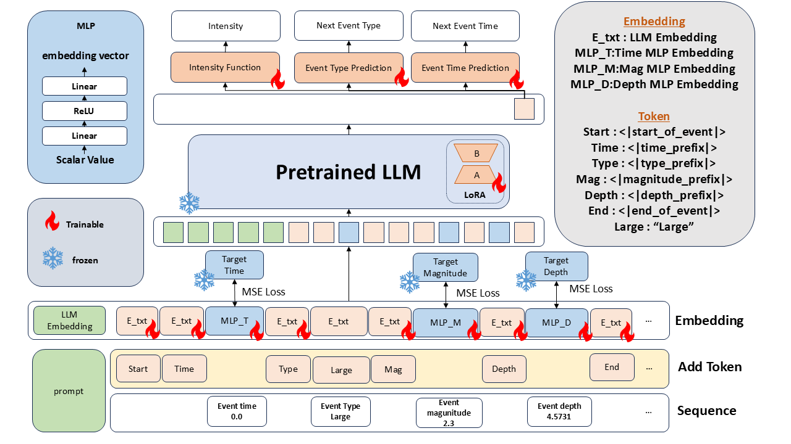

# TPP-LLM: Modeling Temporal Point Processes with Semantic Alignment for Continuous Data

This repository provides an extended implementation of **TPP-LLM**, a framework that integrates Temporal Point Processes (TPPs) with Large Language Models (LLMs) for event sequence prediction. 

Building upon the [original TPP-LLM framework](https://arxiv.org/abs/2410.02062), this project introduces a novel approach to effectively embed continuous numerical data (such as time, earthquake magnitude, and depth) into the LLM's latent space using **Multi-Layer Perceptrons (MLPs)** and **Semantic Alignment Loss** (Concept Anchor Loss).

<div align="center">
  
  <p><em>Overview of our enhanced TPP-LLM architecture. Continuous variables (Time, Magnitude, Depth) are encoded via MLPs and aligned to frozen LLM target anchors using MSE Loss.</em></p>
</div>

## 🌟 Features & Novel Contributions

- **Continuous Value Embedding via MLPs**: Directly encodes continuous numerical features (Magnitude, Depth, Time) using specialized MLP encoders, avoiding the precision loss typical in standard tokenization methods.
- **Semantic Alignment Loss (`beta_semantic`)**: Introduces a custom MSE-based loss function that aligns the output vectors of the MLPs with the pre-trained word embeddings (Frozen Target Anchors) of their respective concepts. This ensures the LLM intuitively "understands" the numerical scales.
- **Parameter-Efficient Fine-Tuning**: Utilizes Low-Rank Adaptation (LoRA) to efficiently fine-tune the LLM for temporal modeling, reducing computational costs while keeping the base LLM frozen.
- **Comprehensive Evaluation & Visualization**: Includes robust tools to automatically generate:
  - Epoch-by-epoch Normalized Confusion Matrices.
  - Qualitative Sequence Trajectory Plots (True vs. Predicted event types/times).
  - 2D Semantic Space Visualizations (PCA) to verify the distance preservation of learned numerical embeddings.
  - Automated metric extraction and aggregation across multiple experimental seeds.

## 🤗 Pre-trained Models & Datasets

For easy reproducibility and immediate evaluation, we provide the fully processed dataset and our trained model weights (trained with `seed=42`) on Hugging Face:

- **📊 Dataset (U.S. Earthquake)**: [Download from Hugging Face](https://huggingface.co/datasets/your-username/us_earthquake)
- **🧠 Model Weights (TPP-LLM Semantic Loss)**: [Download from Hugging Face](https://huggingface.co/your-username/tpp-llm-us-earthquake)

*You can download the dataset and place it directly into the `data/us_earthquake/` directory to skip the preprocessing step. Similarly, downloading the model weights allows you to run evaluations immediately without training from scratch.*

## 📂 Directory Structure

```text
.
├── analysis/
│   └── process_results.py       # Script to extract and summarize best-epoch metrics across seeds
├── configs/
│   └── tpp_llm_ue.config        # Configuration file for US Earthquake experiments
├── data/
│   └── us_earthquake/           # Processed datasets (train.json, dev.json, test.json)
├── images/
│   └── tpp-llm_semantic_loss.png # Architecture diagrams
├── notebooks/
│   └── tpp_data.ipynb           # Data download and preprocessing pipeline (USGS API)
├── save_model/                  # ⚠️ Generated locally: Saved LoRA adapters (Ignored by Git)
├── save_weight/                 # ⚠️ Generated locally: Merged model weights (Ignored by Git)
├── scripts/
│   └── us_earthquake_semantic_loss/
│       └── train_tpp_llm.py     # Main entry point for training
├── src/
│   └── tpp_llm/us_earthquake_semantic_loss/
│       ├── model.py             # Core model with MLP encoders and Semantic Loss
│       ├── runner.py            # Training loop and evaluation logic
│       ├── data.py              # Dataset loader and global statistics calculator
│       ├── layers.py            # Temporal Positional Encoding
│       ├── utils.py             # Prompt generation for event sequences
│       ├── common_utils.py      # Reproducibility (Seed) utilities
│       └── analysis.py          # Visualization and quantitative metric tools
├── tpp-llm_us.sh                # Execution script (runs multiple seeds & betas automatically)
├── requirements.txt             # Strict version dependencies for reproducibility
└── .gitignore                   # Keeps heavy model weights and caches out of the repository
```

## 🛠️ Installation

To ensure full reproducibility of the results reported in this project, please install the exact versions of the dependencies specified in the `requirements.txt`. 

1. Clone the repository:
   ```bash
   git clone [https://github.com/your-username/TPP-LLM.git](https://github.com/your-username/TPP-LLM.git)
   cd TPP-LLM
   ```

2. We highly recommend using a virtual environment (e.g., Conda):
   ```bash
   conda create -n tpp-llm python=3.10 -y
   conda activate tpp-llm
   ```

3. Install the required dependencies:
   ```bash
   pip install -r requirements.txt
   ```

4. Add the source code to your Python path:
   ```bash
   export PYTHONPATH=$PYTHONPATH:$(pwd)
   ```

## 📊 Dataset Preparation (U.S. Earthquake)

This project utilizes the U.S. Earthquake dataset (2020-2024). We provide a complete Jupyter Notebook to download and preprocess the raw data from the USGS API automatically.

1. Open `notebooks/tpp_data.ipynb` in Jupyter or VS Code.
2. Run all cells. The notebook will:
   - Download raw CSV data via the USGS Earthquake API.
   - Filter and group earthquakes into discrete sequences based on location and time.
   - Extract continuous values (`magnitude`, `depth`, `time_since_start`).
   - Split the data into 80/10/10 and generate `train.json`, `dev.json`, and `test.json` in the `data/us_earthquake/` directory.

*(Note: The `data.py` loader will automatically calculate the min/max statistics across these JSON files to dynamically normalize inputs for the MLP encoders).*

## 🚀 Usage

### ⚙️ Core Execution Flags
The behavior of the training script (`train_tpp_llm.py`) is controlled by three main flags. You can mix and match them depending on your goal:

* `--train_flag`: Executes the training loop across all epochs.
* `--save_flag`: Saves the model weights (LoRA adapter + newly added tokens) to the `model_weight_path` whenever a new best validation score is achieved. *(Note: Saved weights are ignored by Git via `.gitignore` to prevent uploading large files).*
* `--load_flag`: Loads pre-trained model weights from the `model_weight_path` before execution.

### Case 1: Training from Scratch
To train the model from scratch and save the best weights locally, execute the provided bash script. (Ensure `--train_flag` and `--save_flag` are passed in `tpp-llm_us.sh` or `configs/tpp_llm_ue.config`).

```bash
bash tpp-llm_us.sh
```

### Case 2: Evaluating a Pre-trained Model
If you downloaded our pre-trained weights from Hugging Face, you can run an evaluation directly on the test set without training. Pass **only** the `--load_flag`:

```bash
python scripts/us_earthquake_semantic_loss/train_tpp_llm.py \
  @configs/tpp_llm_ue.config \
  --model_weight_path="path/to/downloaded/weights" \
  --load_flag
```

### 📈 Aggregating Results
After running experiments across multiple seeds, you can automatically extract the best epoch from the validation logs and aggregate the final test metrics (Mean ± StdDev) by running:

```bash
python analysis/process_results.py
```

This will generate a summary text file (e.g., `beta_10000.0_summary.txt`) in your results directory containing the compiled statistics.

## 📝 Citation

If you find this code or the original TPP-LLM framework useful in your research, please cite the foundational [paper](https://arxiv.org/abs/2410.02062):

```bibtex
@article{liu2024tppllmm,
  title={TPP-LLM: Modeling Temporal Point Processes by Efficiently Fine-Tuning Large Language Models},
  author={Liu, Zefang and Quan, Yinzhu},
  journal={arXiv preprint arXiv:2410.02062},
  year={2024}
}
```

## ❓ Questions or Issues

If you have any questions or encounter any issues, please feel free to [submit an issue](https://github.com/your-username/TPP-LLM/issues) on our GitHub repository.

## 🙏 Acknowledgment

We sincerely thank the authors of the original **[TPP-LLM](https://github.com/zefang-liu/TPP-LLM)** for their excellent contribution to the field of event sequence prediction. We would also like to thank the developers of [EasyTPP](https://github.com/ant-research/EasyTemporalPointProcess) for their valuable implementation of TPPs.

## 📜 License

This project is licensed under the [Apache-2.0 License](LICENSE).